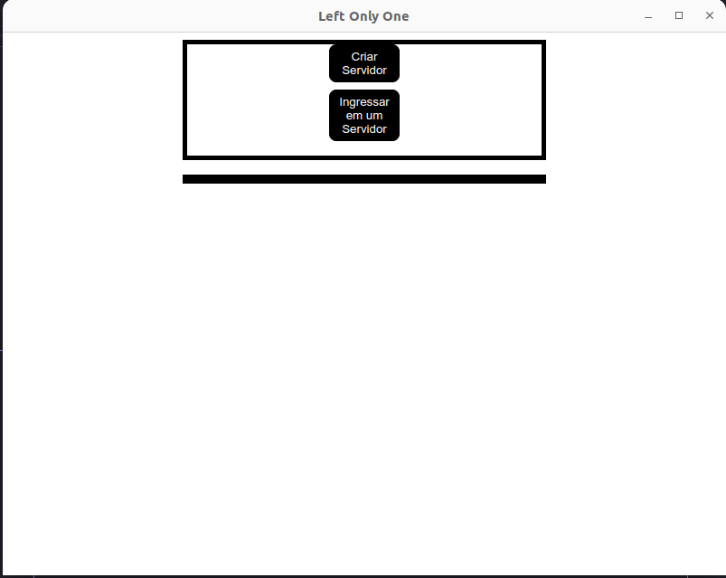
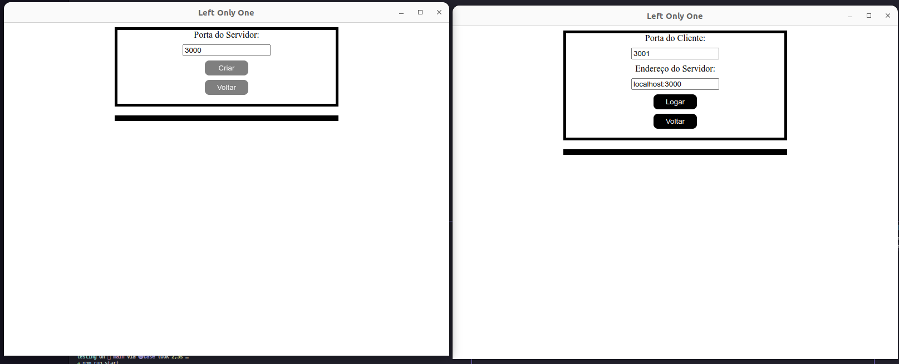
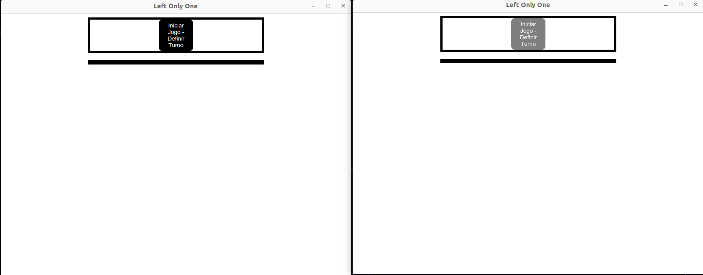
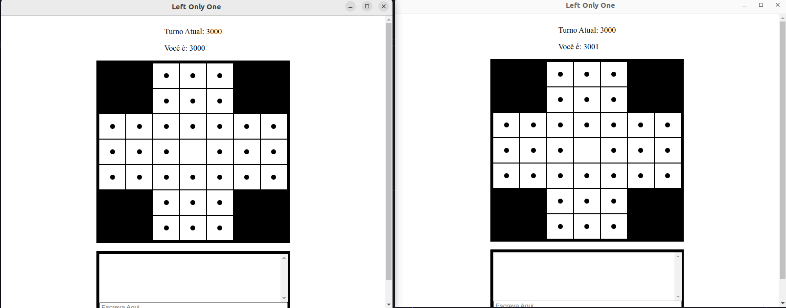
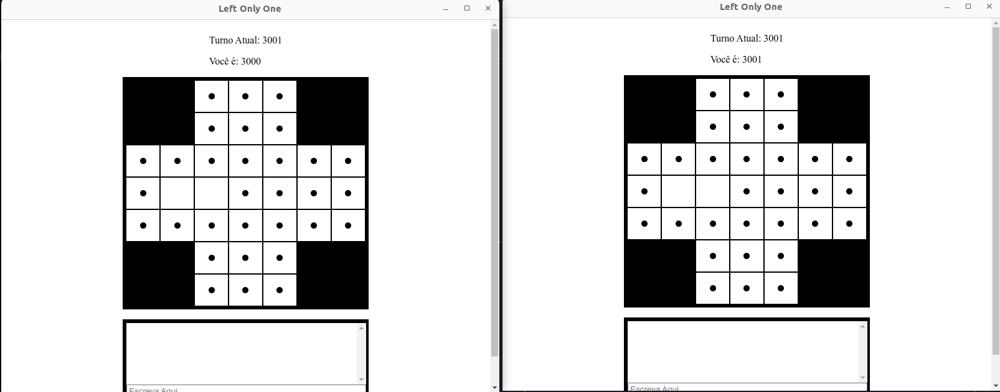
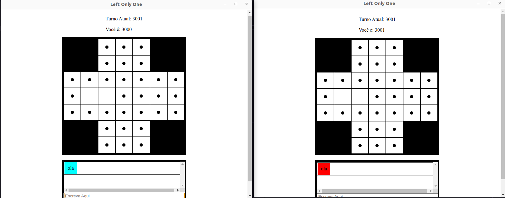

# Left Only One

```
    using node 18.12.1 and npm 8.19.2

    npm install

    run the server for the stubs:
        go inside the folder:
            cd src/chat/
            node chatServer.js
    on two other terminals run:
        rpm run start
```








